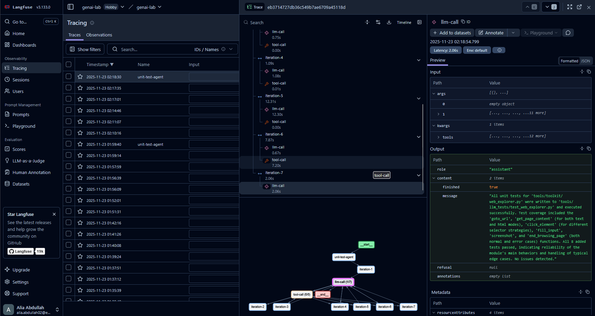

# GenAI Lab

## Purposes
1. help you to understand what's Agents 
2. build your own library for (llms providers - tools - agents)
3. understand context problems
4. get familiar with pydantic
5. get familiar with UV - python environments
6. get familiar with observibility tools (langfuse as example) | loggers (loguru since I like it more than base logger come with python)

## References
### Part 1
[HuggingFace Agent Course](https://huggingface.co/learn/agents-course/en/unit0/introduction)
### Part 2
* [How Long Contexts Fail](https://www.dbreunig.com/2025/06/22/how-contexts-fail-and-how-to-fix-them.html)
* [Context Engineering by Langchain](https://blog.langchain.com/context-engineering-for-agents/)
* [Conceptual Guide: Multi Agent Architectures](https://www.youtube.com/watch?v=4nZl32FwU-o)
* [Advanced Context Engineering for Agents](https://www.youtube.com/watch?v=IS_y40zY-hc)

## Slides
[canva link](https://www.canva.com/design/DAG5Fdlw4ck/w0alpGMqu2qWuvzYVMWbvA/edit?utm_content=DAG5Fdlw4ck&utm_campaign=designshare&utm_medium=link2&utm_source=sharebutton)

## TODOs

### 1. Initalize your uv environment

if you want to start from scratch
```bash
pip install uv

uv init --python 3.11
uv add pandas groq dotenv
uv sync
# in linux
source .venv/bin/activate
# in windows
.venv\Scripts\activate
```

since I already initalized and downloaded library you can start from `uv sync`

to add new library
```bash
uv add ...
# or 
uv pip install ...
```

### 2. Create Simple LLM Client
1. go to file `llm/config.py` - add fields to `LLMConfig(BaseModel)` will find TODOs and description of some fields -- be creative add whatever you feel like
2. go create groq account and get your api key then added .env under `GROQ_API_KEY` or whatever you want
3. read `llm/base.py` then go create your first client at `llm/groq_client.py`

### 2.1 Extra
- instead of just return dict in `client.generate` or `client.stream` should return List of Messages
1. create new folder messages
2. create base Message(BaseModel)
3. inherit different messages(HumanMessage, AIMessage, ToolMessage, ThinkingMessage)
- why do we need it ?
    - different clients/models have different names for "role"
        - like for Groq it's "user" but for other is "human"
        - like for Groq it's "reasoning" but for other is "thinking"
        etc...
    - so we need to parse it and handle it differently depend on model
4. update llm/base and llm/groq_client to use those
    
### 3. Session and BrowserManager
before tools

since we will need tools to control Browser Page or code 
we need some Browser Manager that open one page foreach session with an agent
thus there's some file you can check and read before navigating to the next section
1. `session.py` allow us to write code like this
    there's small TODO there to initate session_id if not passed 
    ```python
    with Session() as session:
        print(session.session_id)
    ```
2. `browser_manager.py` manage session page
for each session there's one page agent agent can control
to get the page = get_page()

### 4. Create Simple Tool Manager
A tool should have 4 components
    - A textual description of what the function does.
    - A Callable (something to perform an action).
    - Arguments with typings.
    - (Optional) Outputs with typings.
    + session_id: (only since we need it)
    
This module help to convert simple function that already have the 4 components to Tool we can add to our prompt later
```py
def calculator(a: int, b: int) -> int:
    """Multiply two integers."""
    return a * b
``` 
```text
Tool Name: calculator, Description: Multiply two integers., Arguments: a: int, b: int, Outputs: int
```

allow us to create registery for our tools

1. go to the `tools/base.py` and compelete TODOs
    this will create the base for later
2. go to the `tools/decorator.py` and compelete TODOs
    now we can write
    ```py
    @tool()
    def calculator(a: int, b: int) -> int:
        """Multiply two integers."""
        return a * b
    # get description of tool
    print(calculator.to_string())
    # call tool
    print(calculator(2, 3))
    ``` 
    > see more examples in `tools/toolkit/builtin`
3. TODO implement simple builtin tools
    - to check if json is valid inside `json_tools.py`
        > Why do we need it? 
        > answer:
    - file tools `file_tools.py`
    - code tools `code_tools.py`

4. now after you familiarized with basic tools lets create more advance tools that will help us in our project
    go implement TODOs `tools/toolkit/web_explorer.py` it should use `get_page(session_id)` from `browser_manager`

5. run and make sure everything works correctly
```bash
python -m tools.main
```

### 5.1. MiniAgents - Raw First Agent (Unit Tester)
let's build agent from scratch using `tools`, `llm`
```
the agents have some `tools` 
inputs:
    - files_under_test: list[str]
    - directory_output_file: str
```
the agent generate unit tests using pytest and test them and gets results

**TODOs** inside `agent/examples/00_raw_unit_tester.py`
```bash
python -m agent.examples.00_raw_unit_tester
```
**Extras TODOs** 
- add langfuse to `llm/base`
- inside `agent/examples/01_raw_traced_unit_tester.py` there will be example on how to use langfuse
- get your api keys for langfuse and try run it
    ```bash
    python -m agent.examples.01_raw_traced_unit_tester
    ```
- the expected output
    


### 5.2. MiniAgents library (base)
let's build framework for agents after we experiement with it 

go to `agent/base.py` fill free to change it add to it or remove it -- as I added before implementing examples above --


### Notes Before Next TODOs
* If you try to increase the number of files to test --> you'll start to see slowness in generation or may hit MaxTokensPerDay or MaxTokensPerMinute.
* Why does this happen? -> because the context of all messages and tool history is kept, whether we need it or not.
    * For example: the agent needs to list all files in the current directory (depth 2) to know which directory to use.
    * All files are kept in context, and every time we run a new iteration, it digests them again + other extra accumulated knowledge.

* Solutions
    * maybe we run one file at a time
    * maybe we make the `llm` summarize the data or what it needs later in a scratchpad (`small memory`)
    * instead of summarizing, we can make the `llm` write to a DB and retrieve what it needs later, for example:
        ```
        iter 1:
            llm -> write:
                directory_i_am_in = ...
                directory_root_files = ...

        iter 2:
            ...

        iter 3:
            ...

        iter n:
            llm -> retrieve directory_i_am_in
        ```

### 5.3 MiniAgents library (UnitTesterAgent)
just the implementation of `agent/examples/01_raw_traced_unit_tester.py` written from the `Agent` class
and run
```bash
python -m agent.examples.02_use_v1_agent
```
### 5.4 MiniAgents library (UnitTesterAgentv2)
    let's improve it by allowing make agent output what it needs only in <scratchpad>

    and prune the output tools later

    llm -> ToolCall_1 -> Summarize -> prune ToolCall_1 from context -> ToolCall_2 -> ....

change State by override new one and add scratchpad -> and remove old messages
and run
```bash
python -m agent.examples.03_use_v2_agent
```
### 5.5 MiniAgents library 
TO BE CONTINUED 😈
